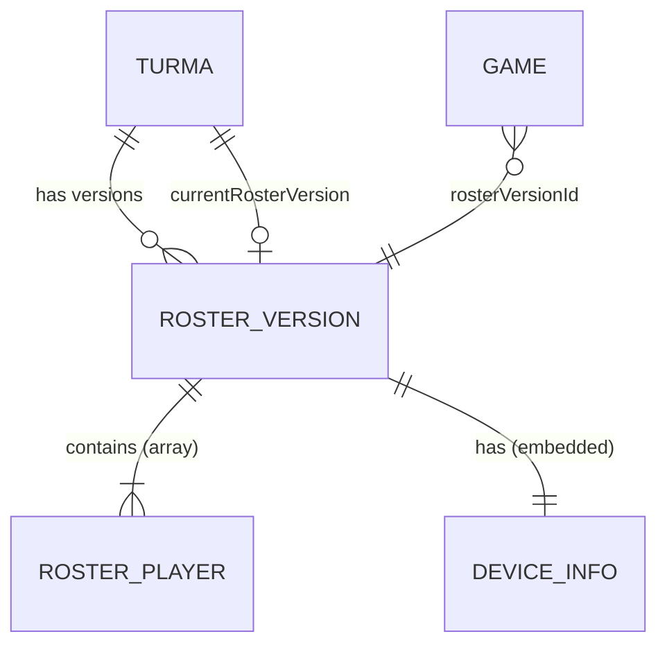
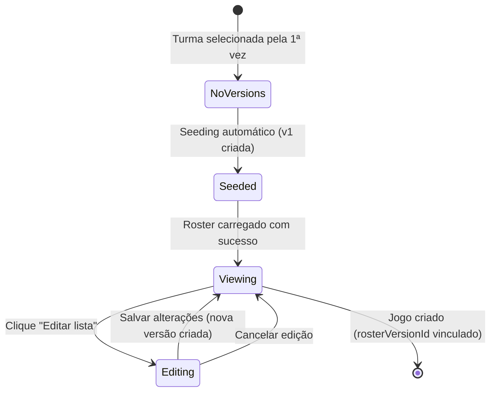
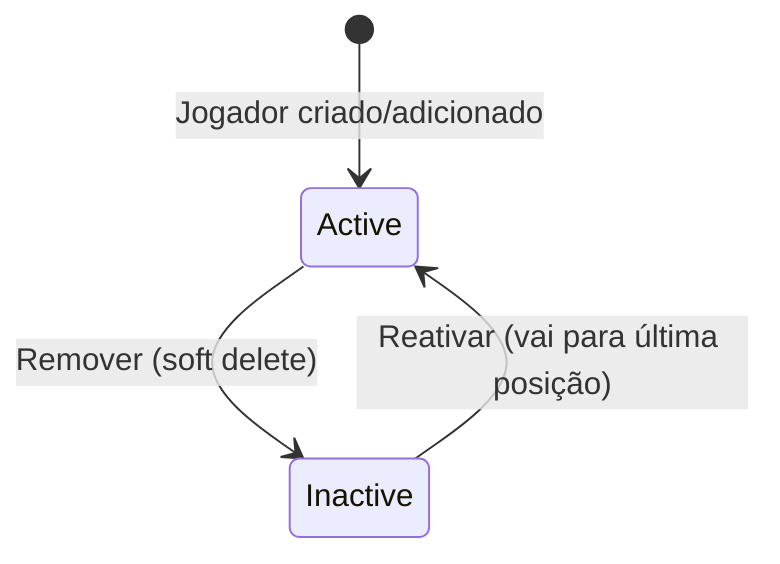

# Data Model: Manutenção do Roster com Versionamento

**Feature**: 006-manutencao-roster | **Date**: 2026-08-02

---

## Entities

### RosterPlayer

Objeto dentro do array `players` de uma `RosterVersion`. Representa um membro da turma com ID estável.

| Campo     | Tipo      | Constraints                          | Descrição                                      |
|-----------|-----------|--------------------------------------|------------------------------------------------|
| `id`      | `string`  | Obrigatório, único na turma          | ID estável (numérico legado ou nanoid 8 chars) |
| `name`    | `string`  | ≥ 2 chars, único case-insensitive    | Nome do jogador                                |
| `initial` | `string`  | 1 char, maiúscula, auto-gerado       | Primeira letra do nome (maiúscula)             |
| `active`  | `boolean` | Obrigatório                          | `true` = ativo, `false` = soft-deleted         |

**Validation Rules**:
- `name`: mínimo 2 caracteres; unicidade case-insensitive dentro da mesma turma
- `initial`: derivado automaticamente como `name.charAt(0).toUpperCase()`
- `id`: gerado uma vez na criação, imutável em todas as versões subsequentes

---

### RosterVersion

Documento imutável em `turmas/{turmaId}/roster-versions/{versionId}`. Snapshot completo da lista de jogadores em um dado momento.

| Campo        | Tipo             | Constraints                            | Descrição                                         |
|--------------|------------------|----------------------------------------|---------------------------------------------------|
| `id`         | `string`         | Auto-generated (Firestore doc ID)      | Identificador único da versão                     |
| `createdAt`  | `Timestamp`      | Server timestamp                       | Data/hora da criação da versão                    |
| `deviceInfo` | `DeviceInfo`     | Obrigatório                            | Informações do dispositivo que fez a edição       |
| `players`    | `RosterPlayer[]` | Obrigatório, ≥ 1 item                 | Array ordenado por prioridade (index 0 = prio 1)  |
| `note`       | `string?`        | Opcional                               | Nota interna (ex: "Versão inicial (migração)")    |

**Firestore Path**: `turmas/{turmaId}/roster-versions/{versionId}`

**Immutability**: Uma vez criado, o documento NUNCA é modificado ou deletado.

---

### DeviceInfo

Objeto embutido em `RosterVersion.deviceInfo`. Capturado automaticamente via `DeviceInfoService`.

| Campo              | Tipo      | Constraints  | Descrição                              |
|--------------------|-----------|--------------|----------------------------------------|
| `userAgent`        | `string`  | Opcional     | Navigator user-agent string            |
| `deviceModel`      | `string`  | Opcional     | Modelo do dispositivo (Client Hints)   |
| `screenResolution` | `string`  | Opcional     | Resolução de tela (`WxH`)              |
| `language`         | `string`  | Opcional     | Idioma do navegador                    |
| `ip`               | `string?` | Opcional     | IP público (via api.ipify.org)         |
| `source`           | `string?` | Opcional     | "Sistema" para seeding automático      |

---

### Turma (extensão)

Campo adicionado ao documento existente `turmas/{turmaId}`:

| Campo                   | Tipo     | Constraints      | Descrição                                    |
|-------------------------|----------|------------------|----------------------------------------------|
| `currentRosterVersion`  | `string` | Obrigatório*     | ID da versão ativa do roster                 |

*Obrigatório após o primeiro seeding. Nulo/ausente antes do seeding trigger.

**Firestore Path**: `turmas/{turmaId}`

---

### Game (extensão)

Campo adicionado ao modelo `Game` existente:

| Campo              | Tipo     | Constraints                   | Descrição                                          |
|--------------------|----------|-------------------------------|----------------------------------------------------|
| `rosterVersionId`  | `string` | Obrigatório na criação        | ID da versão do roster vigente no momento da criação |

**Firestore Path**: `games/{gameId}` (já existente)

---

## Relationships



- **Turma → RosterVersion**: 1:N (subcoleção). Campo `currentRosterVersion` aponta para a versão ativa (1:1).
- **Game → RosterVersion**: N:1. Cada jogo referencia exatamente uma versão; uma versão pode ser referenciada por múltiplos jogos.
- **RosterVersion → RosterPlayer[]**: 1:N (array embutido). A ordem no array define prioridade.
- **RosterVersion → DeviceInfo**: 1:1 (objeto embutido).

---

## State Transitions

### Roster Lifecycle



### Player Status (dentro de uma edição)



---

## TypeScript Interfaces

```typescript
// src/app/models/roster.model.ts

export interface RosterPlayer {
  id: string;         // Stable ID (nanoid 8 ou legado numérico como string)
  name: string;       // ≥ 2 chars
  initial: string;    // Primeira letra maiúscula, auto-gerado
  active: boolean;    // true = ativo, false = inativo (soft delete)
}

export interface RosterDeviceInfo {
  userAgent?: string;
  deviceModel?: string;
  screenResolution?: string;
  language?: string;
  ip?: string | null;
  source?: string;    // "Sistema" para seeding automático
}

export interface RosterVersion {
  id: string;                // Firestore document ID
  createdAt: Date;           // Timestamp da criação
  deviceInfo: RosterDeviceInfo;
  players: RosterPlayer[];   // Ordenado por prioridade (index 0 = prio máx)
  note?: string;             // Nota interna opcional
}

// Extensão ao modelo Game existente
export interface GameWithRoster extends Game {
  rosterVersionId: string;   // ID da versão do roster usada
}
```

---

## Firestore Collection Structure

```text
turmas/
├── sextou/
│   ├── currentRosterVersion: "abc123"      ← campo no documento
│   └── roster-versions/                    ← subcoleção
│       ├── abc123/                         ← documento imutável
│       │   ├── createdAt: Timestamp
│       │   ├── deviceInfo: { userAgent, deviceModel, ... }
│       │   ├── players: [ {id, name, initial, active}, ... ]
│       │   └── note: "..."
│       ├── def456/
│       │   └── ...
│       └── .../
└── domingou/
    ├── currentRosterVersion: "xyz789"
    └── roster-versions/
        └── .../

games/
└── {gameId}/
    ├── ... (campos existentes)
    └── rosterVersionId: "abc123"           ← novo campo
```

---

## Indexes Required (Firestore)

| Collection                              | Fields                    | Order | Purpose                     |
|-----------------------------------------|---------------------------|-------|-----------------------------|
| `turmas/{turmaId}/roster-versions`      | `createdAt`               | DESC  | Histórico paginado          |

> O index composto `createdAt DESC` na subcoleção é necessário para a query do histórico com `orderBy('createdAt', 'desc')` + `limit(20)`.
